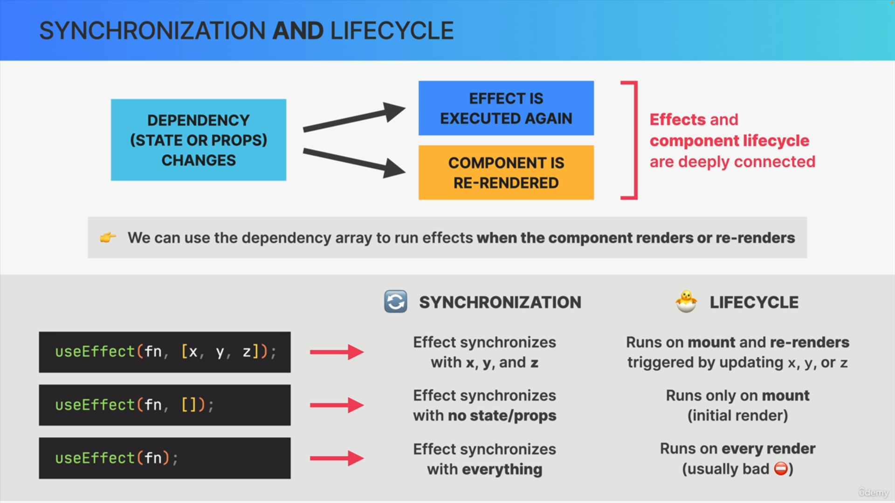
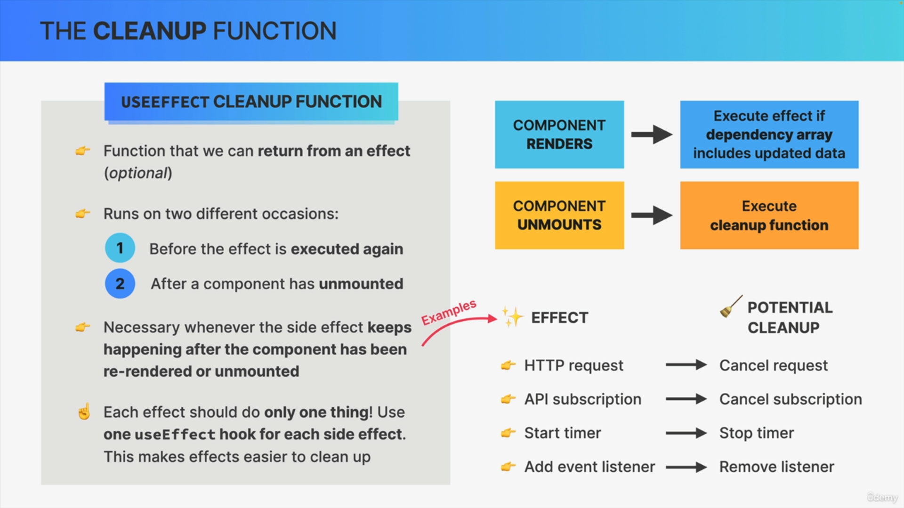

## Prop drilling

> Solution 1: component composition
> we can pass components into components using children prop in the modal.
> Component composition is good for flexibility and reusability and fixing prop drilling
> We create an empty hole in the component and ready to recieve any component to fill it.
> we can pass component using :

1. children prop
2. explicit prop

# Note

> event always needs to handle on JSX element

# Challenge

## Number 1

> https://codesandbox.io/p/sandbox/react-challenge-text-expander-starter-forked-dx7j8l?file=%2Fsrc%2FApp.js%3A59%2C19

# Side effects

> side effect should not be in render logic. And they should not happen during the component render
> effects allow us to write code that will run at different moments:mount,re-render or unmount
> cleanup function: will be called before the component re-renders or unmounts
> is used to keep a component synchronized with some external system(in this example,with the API movie data)
> can be make using : event handler,effects(use effect)
> it s better to use event handlers.
> In strict mode events run multiple times but only in development.

# React strict mode

> In strict mode our effects will not run only once,but actually twice but only in development.

# Effect

> By default,effects run after every render. We can prevent that by passing a dependency array(second augument).
> Each time amy of the dependencies changes,the effect will be executed again.
> Dependencies are state variables and props.
> Every state variable and prop used inside the effect must be included in the dependecy array or we lead to a bug stale closure.
> Effects and life cycle of components are deeply connected.



> Effect runs after the browser paint.

# Cleanup function in useEffect



## example

```js
  useEffect(
    function () {
      if (!title) return;
      document.title = `Movie | ${title}`;
      return function () {
        document.title = "usePopcorn";
        // Clean up function runs after the component unmounted but Closure makes the function remembers all the variables that were present at the time and the place that the function was created
        console.log(`Clean up effect for movie ${title}`);
      };
    },
```

# Abort Controller

> is used to cleanup a fetch request.
> When we have multiple fetch requests and we want the data of the last one.Instead of doing all the fetch requests, we can cancel the previous one as we get a new fetch request using abort controller.
> Each time we abort a fetch request, Js sees it as an error.

# CHALLENGE 1 Currency Convertor in Part12 of the course

> https://codesandbox.io/p/sandbox/currency-convertot-vtk8cd?file=%2Fsrc%2FApp.js%3A58%2C37

# Exports

> Use default exports for components and use named exports for custom hooks.

# Custom hook

> It needs a react hook or it s just a function.
