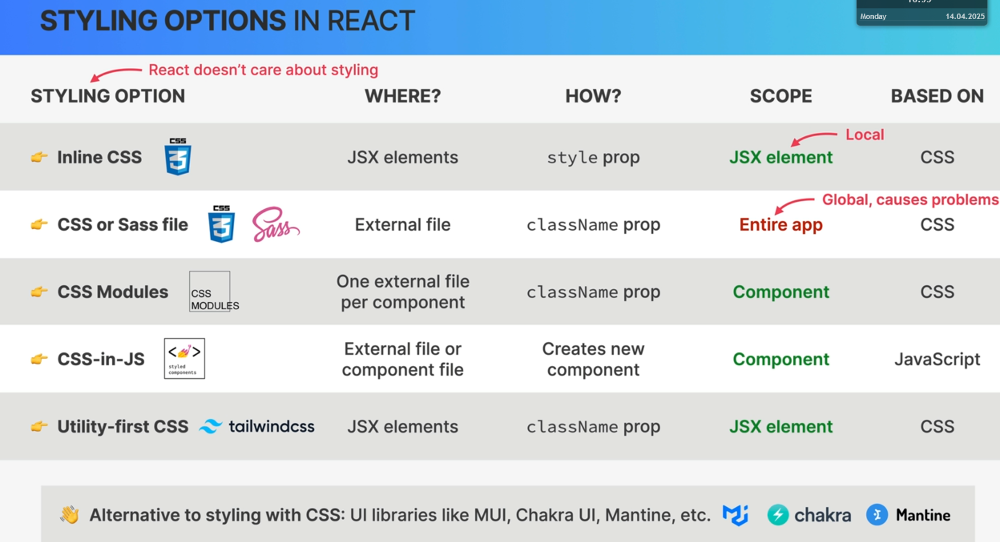

# How to create project using Vite

> npm create vite@4
> npm i
> To run:
> npm run dev

## how to add ESlint into project

1. install some packages as dev dependencies

> npm install eslint vite-plugin-eslint eslint-config-react-app --save-dev

2- create a file called .eslintrc.json and put this text to it:

```{
  "extends": "react-app"
}
```

3- config vite.config.js file by adding this to it:

```js
import { defineConfig } from "vite";
import react from "@vitejs/plugin-react";
import eslint from "vite-plugin-eslint";

// https://vitejs.dev/config/
export default defineConfig({
  plugins: [react(), eslint()],
});
```

# Routing

> it is client side routing and it handled by React Router package.
> it is used to make single page applications.
> Single Page application is good because there will never be a complete page reload.
> Makes the app natural.
> When URL changes,Dom will update. And react update the DOM.

# how to make a single page application

> We dont want hard refreshes,we want to move from one page to another.

```js
<Link to="/pricing">Pricing</Link>
```

# Styling options in React



> Css module: create one external css file per component

## how to define global classes

```js
.nav :global(.active) {
  background-color: green;
}

```

### compusing classes?

### Javascript way of writing a variable name in css

1- in css way:
Example: cta-link
2- JS way:(camelCase)
Example: ctaLink

# Route

## Outlet and index Route

> It is used to create nested routes
> Index is used make default route.

```js
<Route path="app" element={<AppLayout />}>
  <Route index element={<p>list of cities</p>} />
  <Route path="cities" element={<p>list of cities</p>} />
</Route>
```

```js
# re-render nested route
function Sidebar() {
  return (
    <div className={styles.sidebar}>
      <Logo />
      <AppNav />
      <Outlet />

    </div>
  );
}
```

# How to create a fake API

1. Install json server
   ` npm i json-server`
2. Add the below script into package.json file
   `    "server": "json-server --watch data/cities.json --port 8000 -delay 500"`
3. To run the server use:
   ` npm run server`

# State management using url

> Params: used to pass data to the next page
> Query string: to store global state that should be accessable everywhere.

## Params with react router

1. create a new route

   > The element that should be rendered when the url matches the path

```js
<Route path="cities/:id" element={<City />} />
```

2. link that to route
   > We create a link that we can move to the application page bt passing the id data

```
<Link className={styles.cityItem} to={`${id}`}>
```

3. In that route we read the state from URL
   > We read data from URL using useParams

```js
function City() {
const { id } = useParams();
return <h1>City {id}</h1>
```

## Read and set Query String

```js
     <Link
        className={styles.cityItem}
        to={`${id}?lat=${position.lat}&lng=${position.lng}`}
      >
```

```js
function Map() {
  const [searchParams, setSearchParams] = useSearchParams();
  const lat = searchParams.get("lat");
  const lng = searchParams.get("lng");
  return (
    <div className={styles.mapContainer}>
      <h1>Map</h1>
      <h1>
        Position:{lat},{lng}
      </h1>
    </div>
  );
}
```
