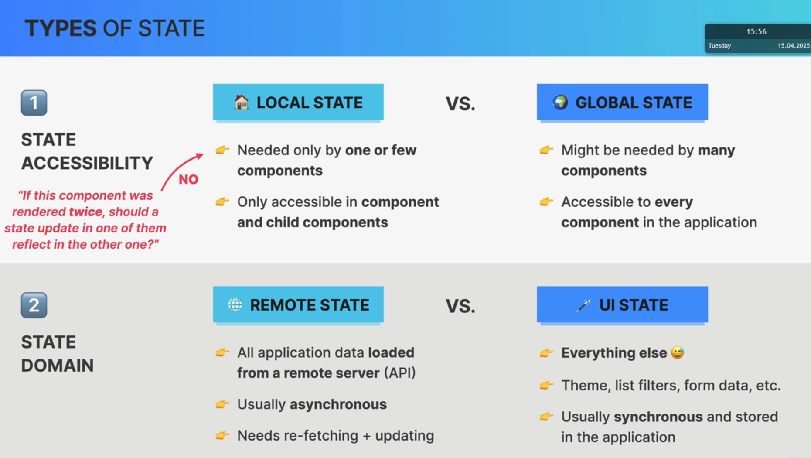
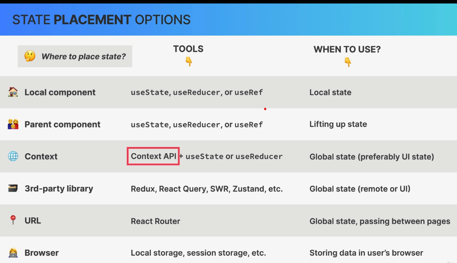
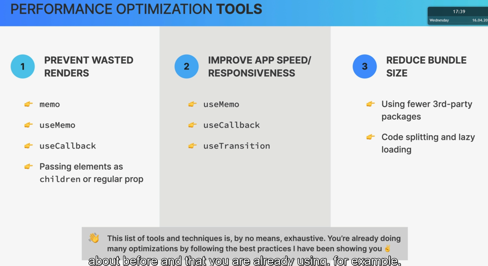
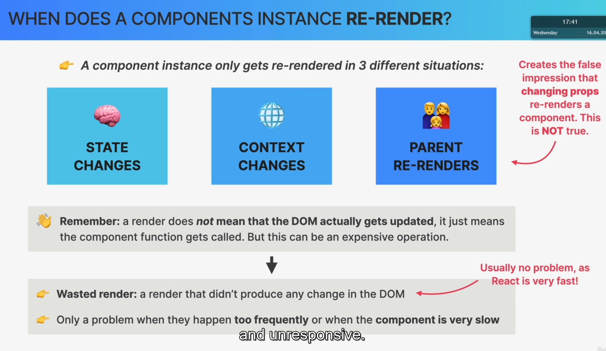

# Context API

> It 's used to solve prop drilling problem.
> 

1. Create provider

```js
const PostContext = createContext();
```

> The variable starts with uppercase letter because it s a component.

2. Provide value

```js
// 2) PROVIDE VALUE TO THE CHILD COMPONENT
<PostContext.Provider
  value={{
    posts: searchedPosts,
    onAddPost: handleAddPost,
    onClearPosts: handleClearPosts,
    searchQuery,
    setSearchQuery,
  }}
></PostContext.Provider>
```

3. cosume the context into components who need this data

```js
const { onClearPosts } = useContext(PostContext);
```

# Different type of states



## State placement



# State management tools


# Performance optimization and Wasted renders

## Performance optimization tools



## when does a components instance re-render



> when a prop changes a component doesnt change because of prop change,but it re-renders because of parent re-render.
