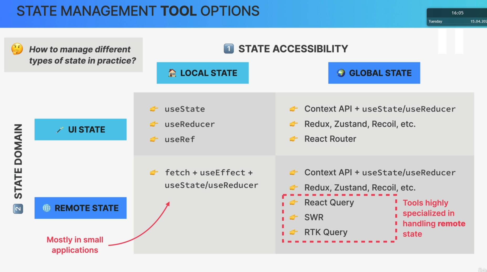
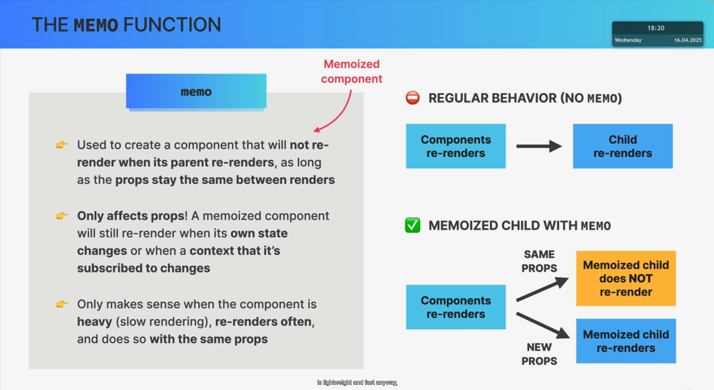

# Context API

> It 's used to solve prop drilling problem.
> 

1. Create provider

```js
const PostContext = createContext();
```

> The variable starts with uppercase letter because it s a component.

2. Provide value

```js
// 2) PROVIDE VALUE TO THE CHILD COMPONENT
<PostContext.Provider
  value={{
    posts: searchedPosts,
    onAddPost: handleAddPost,
    onClearPosts: handleClearPosts,
    searchQuery,
    setSearchQuery,
  }}
></PostContext.Provider>
```

3. cosume the context into components who need this data

```js
const { onClearPosts } = useContext(PostContext);
```

# Different type of states


## State placement


# State management tools



# Performance optimization and Wasted renders

## Performance optimization tools


## when does a components instance re-render


> when a prop changes a component doesnt change because of prop change,but it re-renders because of parent re-render.

> When we pass components with children prop. Parent changing doesnt affect children re-render because they were already created before the component and no state change can affect them. unless they also cosume the context themselves.

```js
function Counter({ children }) {
  const [count, setCount] = useState(0);
  return (
    <div>
      <button onClick={() => setCount((c) => c + 1)}>Increase: {count}</button>
      {children}
    </div>
  );
}
export default function Test() {
  return (
    <div>
      <h1>Slow counter?!?</h1>
      <Counter>
        <SlowComponent />
      </Counter>
    </div>
  );
}
```

# Memoization

1. memoize components with memo
2. memoize objects with useMemo
3. memoize functions with useCallback

## Memo function


