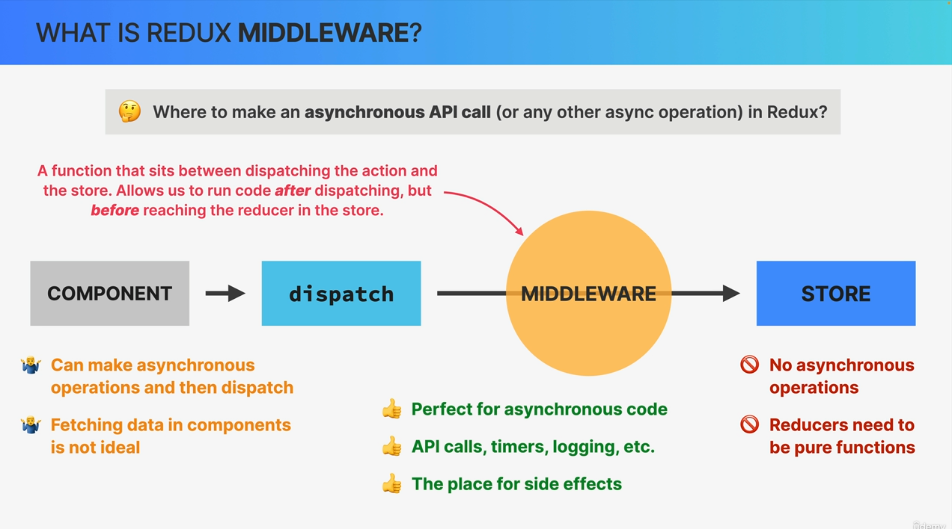
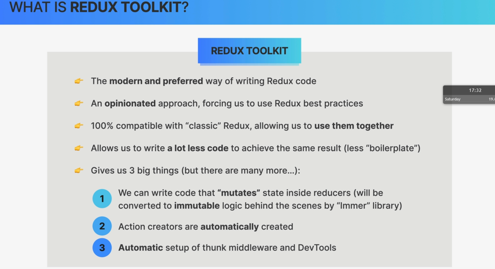
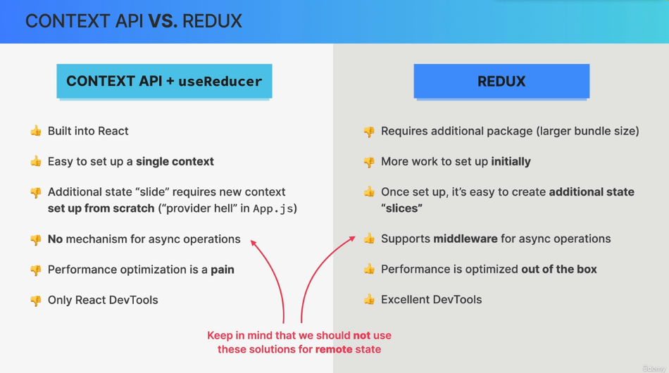
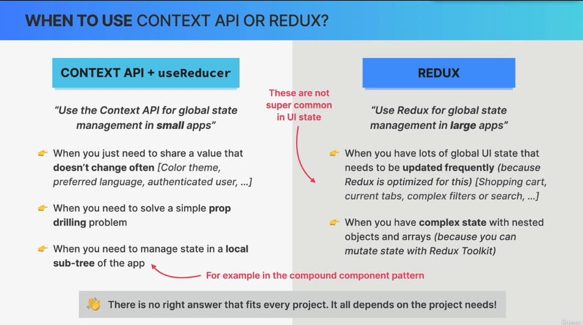

# Old version of redux

## installation

```
npm i redux
npm i react-redux
```

## how to create it

```js
import { createStore } from "redux";
const store = createStore(reducer);
// We should also write reducer function like useReducer.
store.dispatch({ type: "account/deposit", payload: 500 });
console.log(store.getState());
```

## Action creators

> Action creators are simple functions that return action.
> But redux would also work without it.

## Reducers

> If we have multiple reducers,we would actually combine them into rootReducer like this:

```js
const rootReducer = combineReducers({
  account: accountReducer,
  customer: customerReducer,
});
```

## connect redux app with react

```js
import { Provider } from "react-redux";
import store from "./store";

const root = ReactDOM.createRoot(document.getElementById("root"));
root.render(
  <React.StrictMode>
    <Provider store={store}>
      <App />
    </Provider>
  </React.StrictMode>
);
```

> Now our application knows about redux store,which means that every single component can now read data from store and can dispatch actions to it.(broadcasting global state into every component that wants to read it.)

### read data from redux Store

```js
import { useSelector } from "react-redux";
function Customer() {
  const customer = useSelector((store) => store.customer.fullName);
  return <h2>👋 Welcome, {customer}</h2>;
}

export default Customer;
```

> This component is subsccribed to store,and when store changes,this component that was subscribe to that store will re-render.

### how to access dispatch hook

> We can use custom hook that was provided to us by react redux package.

```js
const dispatch = useDispatch();
import { useDispatch } from "react-redux";
import { CreateCustomer } from "./customerSlice";

const dispatch = useDispatch();

function handleClick() {
  dispatch(CreateCustomer(fullName, nationalId));
}
```

# connect react and redux

> useSelector and useDispatch are modern way of connecting react and redux store.
> The old version is using connectAPI.

# Old way of connecting components to redux

```js
function mapStateToProps(state) {
  return {
    balance: state.account.balance,
  };
}
export default connect(mapStateToProps)(BalanceDisplay);
```

# Extend functionality of redux by MIDDLEWARE

> Where to fetch data from API? not in store, not in component,but in middleware
> middleware: is a function that sits between dispatching the action and the store.Allows us to run after dispatching,but before reaching the reducer in the store.
> \
> Most popular middleware in Redux is Redux Thunk.
> Middleware makes dispatch function to wait before getting into the store.

## how to use middleware

1. install middleware package

```
npm i redux-thunk
```

2. apply that middleware to our store

```js
const store = createStore(rootReducer, applyMiddleware(thunk));
```

3. use middleware in our action creator functions

```js
export function deposit(amount, currency) {
  console.log(currency);
  if (currency === "USD") return { type: "account/deposit", payload: amount };
  return async function (dispatch, getState) {
    dispatch({ type: "account/convertingCurrency" });
    // API call
    console.log(currency, amount);
    const res = await fetch(
      `https://api.frankfurter.app/latest?amount=${amount}&from=${currency}&to=USD`
    );
    const data = await res.json();
    console.log(data);
    const converted = data.rates.USD;
    dispatch({ type: "account/deposit", payload: converted });
    // return action
  };
}
```

# middleware DevTools

1. install chrome redux devTools extension
2. install redux package

````js
npm i redux-devtools-extension

> code Example:
```js
    dispatch(deposit(depositAmount, currency));


````

# Modern way of writing redux(redux Toolkit)



# install redux toolkit

```
npm i @reduxjs/toolkit
```

```js
import { configureStore } from "@reduxjs/toolkit";
```

> ConfigreStore will automatically will combine our reducers,add thunk middleware,setup devloper tools.

```js
const store = configureStore({
  reducer: {
    account: accountReducer,
    customer: customerReducer,
  },
});
```

## createSlice

> with createslice,we can mutate our state inside reducers.

## 2 auguments in actions in reducer in toolkit

> we need to prepare payload for thaat

```js
reducers: {
    createCustomer: {
      prepare(fullName, nationalID) {
        return {
          payload: {
            fullName,
            nationalID,
            createdAt: new Date().toISOString(),
          },
        };
      },
      reducer(state, action) {
        state.fullName = action.payload.fullName;
        state.nationalID = action.payload.nationalID;
        state.createdAt = action.payload.createdAt;
      },
    },
}

```

# Context API + reducer vs REDUX

# when to use which one



